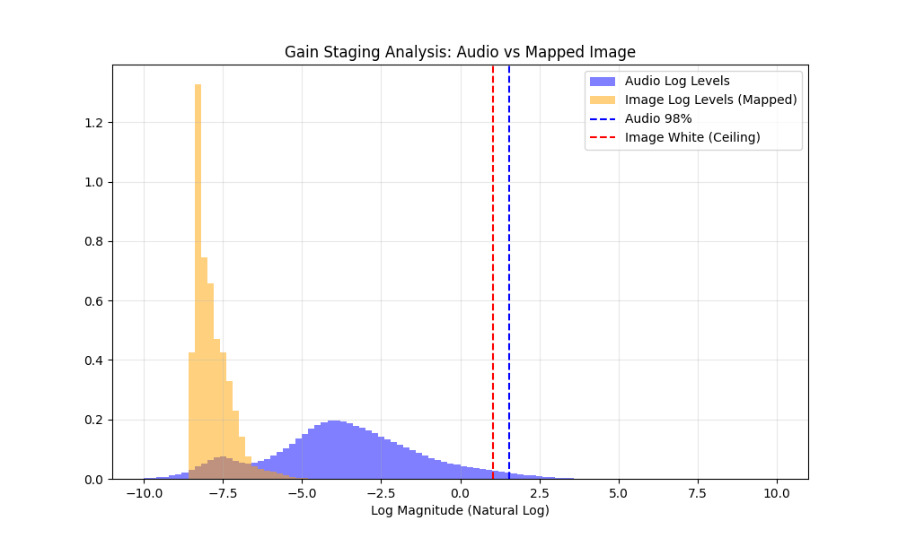

# MOSS: Multi-Objective Sound Synthesis

**MOSS** is a system that creates "Hybrid Audio" that lies on the boundary between an **Image** and a **Sound**.

It uses **Multi-Objective Gradient Optimization** to learn a spectral mask that blends a target image with a target ambient track.
The result is a set of audio files representing different trade-offs between "Pure Music" and "Pure Image Spectrogram".



## Key Features

- **Mask-Based Encoding**: Optimizes a 128x256 mask to blend visual and auditory content in the time-frequency domain.
- **Log-Domain Mixing**: Blends magnitudes in Decibels (dB) for natural fade-ins/outs.
- **Web Interface**: Modern React/Vite frontend for interactive exploration.
- **Real-Time Visualization**: Watch the optimization process live with loss plots and spectrogram updates.
- **Iterative Steering**: Guide the optimization towards "Better Image" or "Better Audio" interactively.

## Installation

```bash
# Create virtual environment
python -m venv venv
source venv/bin/activate

# Install dependencies
pip install -r requirements.txt
```

## Quick Start

### 1. Start the Application
Use the provided startup script to launch both the FastAPI backend and React frontend.

```bash
./start.sh
```

### 2. Access the Interface
Open your browser and navigate to:
[http://localhost:5173](http://localhost:5173)

### 3. Usage
1.  **Select Resources**: Choose a target image and target audio file from the grid.
2.  **Ignite Optimization**: Click the fire button to start the process.
3.  **Explore**:
    *   Watch the spectrogram evolve.
    *   Click "Better Image" or "Better Audio" to steer the result.
    *   Click "Pareto Front" to generate a diverse set of solutions.

## Architecture

*   **Backend**: FastAPI (Python) - Handles optimization logic, audio processing, and file serving.
*   **Frontend**: React + Vite + TailwindCSS - Provides the interactive user interface.
*   **Optimization**: PyTorch-based gradient descent optimizing for perceptual visual difference and audio spectral loss.

## License

MIT
